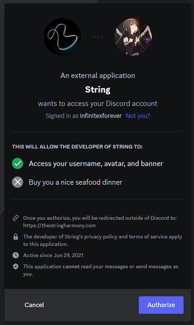
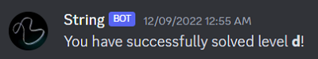
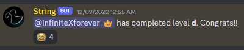
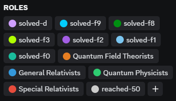
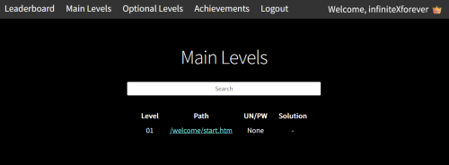

# String - Track your riddle progress

Try now: [https://thestringharmony.com/stringbot/](https://thestringharmony.com/stringbot/)

**String** is a Discord bot and a web application for online riddles that

- **automatically** saves players' solving progress
- **automatically** unlocks Discord channels/roles for players
- provides both user-friendly web app and Discord commands for players to review their progress
- provides extra features such as achievements and leaderboard

It is created by Kobe Li (infiniteXforever),
the creator of the online riddle [The String Harmony](https://thestringharmony.com/).

## For players

String is very easy to use:

- First login using your Discord account by visiting [here](https://thestringharmony.com/login/)

- When you solve a level or find an achievement on the website,
you will get messages and new roles/channel access on Discord **automatically**

- Visit [here](https://thestringharmony.com/stringbot/) to review your level progress and
check out leaderboard and achievements

- The bot also has some commands for you to use:

1. `!stat`: Show player statistics
2. `!recall [level]`: Show links and username/password of the levels you reached/solved
3. `!continue`: Show links and username/password of your current level
4. `!color [level]`: Change your username color according to solved optional levels
5. `!reach [path]`: Register the solution pages you reached, when the automatic features don't work

## For creators

This newer version is not ready for public use yet. Please visit
[here](https://github.com/liwingyankobe/string-public) if you would like to build your own bot.

## The files

The files in this repository are for:

- `bot_auto.py`: A Quart/Flask app that supports the operations of both the Discord bot
and web APIs, connected to a PostgreSQL database.
- `Procfile`, `requirements.txt`, `runtime.txt`: Configurations for deployment onto Heroku
- `stringbot_original.js`: The script to be triggered on level pages
- `/login`: The website folder for login using Discord OAuth2
- `/src`: The source code of the web app written in React.

## Contact me

Ideas and suggestions are welcome. You can contact me (infiniteXforever) on
[Discord](https://discord.gg/q8pYdR73T8) by joining our online riddle server.